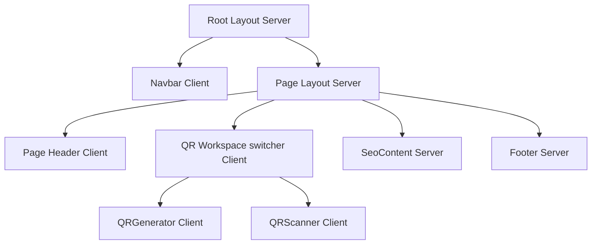

# Utility Site Design (KMDIGITS / OKM DIGITAL WORKS)

Reference implementations:
- [mission](file:///Users/manik/Documents/GitHub/mission) — hub (`kmdigits.com`) rewrites, `HUB_APPS`, sitemaps
- [calculator](file:///Users/manik/Documents/GitHub/calculator) — Next.js + `basePath` under `/calculator` (preferred Next template)
- [pulsar](file:///Users/manik/Documents/GitHub/pulsar) — Next.js + MUI QR under `/free-qr-code-generator`
- [kural-chronicle](file:///Users/manik/Documents/GitHub/kural-chronicle) — Vite + React + Tailwind under `/thirukkural`

**Introducing a new app?** Read [hub-onboarding.md](hub-onboarding.md) first and copy the closest sibling. Do not invent a new embedding style.

## Agent Workflow

When working on a utility site in this family:

1. **Identify the stack first** — Next.js App Router (Calculator/Pulsar) or Vite SPA (Kural). Do not migrate stacks unless explicitly requested.
2. **If the app ships on the hub** — follow [hub-onboarding.md](hub-onboarding.md): absolute assets, absolute favicons, mission rewrites + `HUB_APPS`, sitemaps, Google verify, PWA denylist.
3. **Preserve SEO + PWA + app-shell patterns** from this skill regardless of stack.
4. **Prefer client-side processing** — heavy work (canvas, camera, file parsing) stays in the browser.
5. **Dynamic-import heavy packages** — load libraries only when needed.
6. **Keep PWA install flow wired** — manifest, service worker, install prompt, iOS safe areas.

### New App Under Mission (mandatory)

When the user adds a **new** utility under `kmdigits.com`:

1. Copy **Calculator** (Next) or **Kural** (Vite) embedding — see [hub-onboarding.md](hub-onboarding.md).
2. Wire **mission**: `vercel.json` rewrites, `src/config/apps.ts` favicon entry, PWA `navigateFallbackDenylist`, `sitemap-pages.xml` + sitemap index.
3. Public URLs / sitemap locs use `https://www.kmdigits.com/{path}` (not bare `*.vercel.app`).
4. Own favicon via absolute URLs; tab must not fall back to the hub icon.
5. Smoke-test hub path: HTML 200, JS/CSS from child origin 200, favicon 200.

### New Page / Feature Checklist

- [ ] Unique `<h1>`, `<main>`, and semantic `<footer>` structure
- [ ] Sticky footer via shared shell (`AppLayout` / `PageBackground`) — bottom on short pages (§4)
- [ ] Title, description, canonical, OpenGraph, and Twitter cards on every page
- [ ] Canonicals/sitemaps use hub host when the app is embedded
- [ ] Page added to sitemap; robots.txt/rules updated if needed
- [ ] Mobile-first layout tested down to `320px` width
- [ ] Heavy deps dynamically imported inside `useEffect` or event handlers
- [ ] Theme loads without flash on reload (cookie + CSS fallback)
- [ ] PWA manifest, icons (192 + 512), theme-color, apple-mobile-web-app meta
- [ ] Absolute favicon / apple-touch URLs when proxied through mission
- [ ] Service worker precaches shell; runtime caching for fonts/API if offline matters
- [ ] `useInstallPrompt` hook + install item in sidebar/nav (no auto-popup on first visit)
- [ ] iOS safe-area insets applied once per edge (no double padding — see §10)
- [ ] App shell: sidebar/drawer + scrollable main + sticky mobile header (see §10)
- [ ] Long nav sections scroll inside sidebar; mobile drawer closes on navigation
- [ ] Primary content centered; secondary actions use floating pill, not full-width bar
- [ ] Vercel Web Analytics enabled in dashboard; `@vercel/analytics` + `<Analytics />` in root layout/App

### Key File Locations

| Concern | Next.js (Calculator / Pulsar) | Vite (Kural Chronicle) | Mission hub |
|---------|-------------------------------|------------------------|-------------|
| Hub path + favicons | `src/lib/site.ts`, `layout.tsx` `icons` | `vite.config.ts` `base`, `index.html` icons | `src/config/apps.ts`, `vercel.json` |
| Root layout + analytics | `src/app/layout.tsx` | `src/App.tsx` | `src/App.tsx` |
| PWA manifest | `public/manifest.json` | `vite.config.ts` → `VitePWA.manifest` | `vite.config.ts` |
| Service worker | `@ducanh2912/next-pwa` in `next.config.ts` | `vite-plugin-pwa` | denylist child paths |
| Site URL helpers | `src/lib/site.ts` (`SITE_URL`, `ASSET_ORIGIN`) | production `base` absolute origin | — |
| Sitemap / robots | `src/app/sitemap.ts`, `robots.ts` | `public/sitemap.xml`, `robots.txt` | `public/sitemap.xml` index |
| Google verify file | `public/google….html` (+ under `basePath` if needed) | `public/google….html` | rewrite must reach file |
| App shell | `Navbar` + page flex column | `AppLayout` + `AppSidebar` | landing only |

---

## 1. Next.js Stack Architecture

Pulsar is built on **Next.js 16 (App Router)**, utilizing a split rendering boundary structure to optimize SEO, compilation speeds, and runtime client interactions.

### Component Directory Design
- **Server Components (Default)**: Handles initial page skeletons, layout assets, tracking triggers, and meta tag compilation.
- **Client Components (`'use client';`)**: Isolated stateful widgets (like the camera feed, image processors, and interactive customizers).



---

## 2. Search Engine Optimization (SEO)

To maintain maximum organic indexability and semantic structure:
- **Title & Description Metadata**: Programmatic generation of canonical alternates, keywords, and description blocks tailored to search queries.
- **OpenGraph & Twitter Cards**: Configured in `src/app/free-qr-code-generator/page.tsx` with custom preview images, locale specifications, and card widths.
- **Dynamic Sitemap & Robots**: Structured XML builders configured at `src/app/sitemap.ts` and `src/app/robots.ts` to direct index crawlers cleanly.
- **Semantic HTML**: Organized hierarchical layouts containing unique `<h1...>` page tags, `<main>` content areas, and structural `<footer>` segments.

For Vite SPAs, use `react-helmet-async` via a shared `PageMeta` component plus static defaults in `index.html`.

---

## 3. Vercel Web Analytics

Follow the [Vercel Web Analytics quickstart](https://vercel.com/docs/analytics/quickstart) on every utility site deployed to Vercel.

### Setup checklist

1. **Enable in Vercel Dashboard** — Project → **Analytics** → **Enable**. After the next deploy, Vercel adds `/_vercel/insights/*` routes.
2. **Install the package** — `npm i @vercel/analytics` (already in both reference apps at `^2.0.1`).
3. **Add `<Analytics />` at the app root** — use the framework-specific import (see below).
4. **Deploy to Vercel** — analytics does **not** record in local dev; verify in production.
5. **Verify** — In the browser Network tab on the live site, confirm a request to `/_vercel/insights/view` (or the script from `va.vercel-scripts.com`) on page load.

### Next.js App Router (Pulsar)

Use `@vercel/analytics/next` in the root layout — this import includes App Router route support.

```tsx
// src/app/layout.tsx
import { Analytics } from "@vercel/analytics/next";

export default function RootLayout({ children }: { children: React.ReactNode }) {
  return (
    <html lang="en">
      <body>
        {children}
        <Analytics />
      </body>
    </html>
  );
}
```

Reference: [Next.js quickstart](https://vercel.com/docs/analytics/quickstart?framework=nextjs#add-the-analytics-component-to-your-app)

### Vite + React SPA (Kural Chronicle)

Use `@vercel/analytics/react` in the root App component.

```tsx
// src/App.tsx
import { Analytics } from "@vercel/analytics/react";

export default function App() {
  return (
    <>
      {/* routers, providers, routes… */}
      <Analytics />
    </>
  );
}
```

Reference: [React / CRA quickstart](https://vercel.com/docs/analytics/quickstart?framework=create-react-app#add-the-analytics-component-to-your-app)

### Notes

- Place `<Analytics />` once at the root — do not duplicate per page.
- Custom events (`track()`) are available on Pro/Enterprise; page views are automatic.
- Privacy details: [Vercel Analytics privacy policy](https://vercel.com/docs/analytics/privacy-policy).

---

## 4. Sticky Copyright Footer (every page)

The footer must sit at the **bottom of the viewport on short pages** and after content on long pages. Never leave it floating mid-screen under short content (e.g. Search with no results).

**Brand**: Match the sibling — hub uses **KMDIGITS**; tools often say **OKM DIGITAL WORKS**. Do not invent a third string.  
**Year**: `© {new Date().getFullYear()} …` — never hardcode.

### Canonical shell pattern (required)

Put the footer in the **shared shell once** (`AppLayout` / `PageBackground`), not duplicated per page.

**Vite (Kural `AppLayout`)** — scrollable main, fill short pages:

```tsx
<main className="relative flex min-h-0 flex-1 flex-col overflow-y-auto">
  <div className="flex min-h-full flex-1 flex-col">
    <div className="flex min-h-0 flex-1 flex-col">{children}</div>
    <SiteFooter /> {/* shrink-0 + mt-auto */}
  </div>
</main>
```

**Next.js + MUI (`PageBackground`)** — Calculator / Pulsar / DocScan:

```tsx
<Box sx={{ display: 'flex', flexDirection: 'column', minHeight: '100dvh' }}>
  <Box sx={{ flex: 1, display: 'flex', flexDirection: 'column', minHeight: 0 }}>
    {children}
  </Box>
  <SiteFooter /> {/* mt: 'auto', flexShrink: 0 */}
</Box>
```

**Hub landing (Mission)**: outer `flex min-h-dvh flex-col` → `<main className="flex-1">` → `<SiteFooter className="mt-auto shrink-0" />`.

### Rules

- Prefer `minHeight: 100dvh` (or `min-h-dvh` / `min-h-full` inside a flex-1 main) over bare `100vh`.
- Footer: `mt-auto` / `mt: 'auto'` + `shrink-0` / `flexShrink: 0`.
- Include safe-area bottom padding where the device has a home indicator.
- Do **not** render a second page-level footer if the shell already has one.

---

## 5. Unified Common Theme Registry

Material UI (MUI) themes are managed in `src/theme/` to ensure visual cohesion across all components:
- **Font Tokens**: Paired primary **Outfit** headers (300 to 800 weights) with **Inter** body text.
- **Palette Registry**: Sleek obsidian dark modes and classic light colors utilizing exact shared color tokens:
  - Primary: `#0A66C2` (Pulsar Blue)
  - Secondary: `#00B4D8` (Cyan Accent)
  - Light Divider: `#E5E7EB` | Dark Divider: `#1F2937`
- **Global CSS Overrides**: Rounded custom card borders (`16px`), button shapes (`8px`), and interactive outline grids.

For Tailwind/shadcn apps, keep equivalent tokens in CSS variables in `src/index.css` instead of MUI.

---

## 6. Zero-Flash Theme Reload Strategy

### The Problem
During Server-Side Rendering (SSR), React compiles components prior to client browser mounting. If the initial theme state inside the client-side `ThemeRegistry` defaults to `light`, a client set to `dark` mode will experience a **bright light flash** (blink) on page reload as React hydrats.

### The Zero-Blink Solution
To eliminate the dark-mode reload blink, we utilize a **Server-Side Cookie Parser**:

1. **Active Cookie Handshake**: When the user switches themes, a cookie (`theme-mode`) is saved.
2. **Server-Side Page Read**: The root layout component reads this cookie during server-side compilation:
   ```typescript
   // src/app/layout.tsx (Server Component)
   import { cookies } from 'next/headers';
   
   export default function RootLayout({ children }) {
     const cookieStore = cookies();
     const initialMode = cookieStore.get('theme-mode')?.value || 'light';
     return <ThemeRegistry defaultMode={initialMode}>{children}</ThemeRegistry>;
   }
   ```
3. **Pre-Hydration Matching**: The `ThemeRegistry` client component receives `defaultMode` as a prop and initializes its React state with it. This ensures the HTML string generated on the server is matching the client preference from the very first frame.
4. **CSS Media Fallback**: CSS variables are set in `globals.css` using standard media queries to style backgrounds immediately while javascript packages load:
   ```css
   @media (prefers-color-scheme: dark) {
     :root {
       --fallback-bg: #0B0F19;
       --fallback-text: #F9FAFB;
     }
   }
   ```

For Vite SPAs without SSR, add an inline blocking script in `index.html` that reads the `theme-mode` cookie and sets background color before React mounts.

---

## 7. Mobile Responsive Design

All custom views utilize a mobile-first responsive layout grid:
- **Adaptive Workspace switches**: Flex wrapping (`flexWrap: 'wrap'`) and viewport-scaled font sizes prevent container overflow on screens down to `320px` width.
- **MUI Grid Breakpoints**: Swaps column orders between XS (mobile stacking) and MD (side-by-side desktop panels) layouts automatically:
  ```typescript
  <Grid size={{ xs: 12, md: 7, lg: 8 }}>
  ```
- **Camera Scanning Aspect**: Viewfinders scale dynamically using relative aspect ratios (`aspectRatio: '4/3'`) to prevent camera stream cropping on narrow screens.
- **App shell**: Follow §10 for sidebar/drawer, safe areas, scroll containers, and floating actions — not just page-level grids.

---

## 8. Client Performance Optimizations

To keep the initial load speeds high and JS bundles lightweight:
1. **Dynamic Code Splitting**: Heavy client packages are loaded asynchronously only when needed:
   - `qr-code-styling` is imported dynamically inside standard `useEffect` hooks.
   - `canvas-confetti` is loaded on demand only upon successful downloads.
2. **Canvas-Based Processing**: Image uploading/camera decoding is handled completely within local browser canvas buffers (`jsQR`). This removes the need for slow, server-side payload roundtrips, resulting in zero server load and instant parsing results.

Use `React.lazy()` for route-level code splitting in Vite SPAs.

---

## 9. Progressive Web App (PWA)

Every OKM utility site should be installable and work offline for core flows after first load. Reference: **Kural Chronicle** (full PWA) and **Pulsar** (Next.js PWA).

### Manifest Requirements
- `name`, `short_name`, `description`, `start_url`, `scope`, `display: "standalone"`
- Icons at **192×192** and **512×512** (include one `maskable` icon)
- `theme_color` and `background_color` matching the app palette
- `viewport-fit=cover` in HTML for notched devices

### HTML Meta (both stacks)
```html
<meta name="theme-color" content="#0c0907" />
<meta name="apple-mobile-web-app-capable" content="yes" />
<meta name="apple-mobile-web-app-status-bar-style" content="black-translucent" />
<link rel="apple-touch-icon" href="/pwa-192x192.png" />
<link rel="manifest" href="/manifest.json" />
```

When the app is rewritten through **mission**, favicon / apple-touch / manifest URLs must be **absolute** to the Vercel origin (see [hub-onboarding.md](hub-onboarding.md)). Root-relative `/favicon.ico` resolves to the hub.

### Vite Stack — `vite-plugin-pwa`
```typescript
VitePWA({
  registerType: "autoUpdate",
  injectRegister: "auto",
  manifest: { /* name, icons, theme_color, display: "standalone" */ },
  workbox: {
    globPatterns: ["**/*.{js,css,html,ico,png,svg,woff2}"],
    runtimeCaching: [
      // CacheFirst for Google Fonts
      // NetworkFirst for API calls that should work offline after first visit
    ],
  },
})
```

### Next.js Stack — `@ducanh2912/next-pwa`
```typescript
import withPWAInit from "@ducanh2912/next-pwa";

const withPWA = withPWAInit({
  dest: "public",
  disable: process.env.NODE_ENV === "development",
  register: true,
});

export default withPWA({ turbopack: {}, /* next config */ });
```

For Next.js 16, PWA plugins require Webpack — set `"build": "next build --webpack"` in `package.json` (Turbopack is default but does not run webpack PWA plugins).

### Install Prompt Pattern
Shared hook captures `beforeinstallprompt` globally before React mounts:

1. **`useInstallPrompt`** — detects standalone mode (iOS + Android), stores deferred prompt. No auto-popup on first visit.
2. **Side menu install item** — add "Install App" to sidebar/nav; user opts in manually.
3. **On click** — if native prompt available, call `installApp()`; otherwise show dialog with iOS "Add to Home Screen" instructions.
4. **Hide when installed** — remove menu item once app runs in standalone mode.

### iOS Safe Area CSS

**Do not pad `#root` top and also pad the sticky header** — that stacks safe-area twice and leaves a visible gap under the notch. Apply each inset once, on the element that needs it.

```css
html {
  scroll-behavior: smooth;
}

body {
  min-height: 100dvh;
  padding-left: env(safe-area-inset-left);
  padding-right: env(safe-area-inset-right);
  /* Do NOT add padding-top here if a sticky header handles it */
}

/* Status-bar color fill only — does not push content */
body::before {
  content: '';
  position: fixed;
  top: 0;
  left: 0;
  right: 0;
  height: env(safe-area-inset-top);
  background-color: /* match --background */;
  z-index: 9999;
}

#root {
  min-height: 100dvh;
  /* No padding-top — sticky header/sidebar header own the top inset */
}
```

Apply safe-area on specific UI chrome:

| Element | CSS |
|---------|-----|
| Mobile sticky header | `py-2.5` only — header is already below `body::before` fill |
| Mobile drawer header | `pt-[max(0.75rem,env(safe-area-inset-top))] md:pt-3` |
| Bottom floating action | `pb-[max(0.75rem,env(safe-area-inset-bottom))]` |

### PWA Testing
- Deploy to HTTPS (required for install prompt)
- Chrome DevTools → Application → Manifest + Service Workers
- Test install on Android Chrome and iOS Safari (Share → Add to Home Screen)
- Verify offline: load app once, go offline, confirm cached shell loads

---

## 10. App Shell, Sidebar & Fluid UX

Reference: **Kural Chronicle** (`AppLayout.tsx`, `AppSidebar.tsx`). Apply these patterns to every multi-page utility site.

### Layout architecture

The app shell is a **flex column** with a persistent nav rail and a scrollable content pane. Never let the whole page body scroll when only content should.

**Vite + shadcn (canonical pattern)**

```tsx
<SidebarProvider defaultOpen>
  <AppSidebar />
  <SidebarInset className="flex min-h-svh min-h-[100dvh] flex-col overflow-hidden">
    {/* Mobile-only sticky header */}
    <header className="sticky top-0 z-40 … md:hidden">
      <SidebarTrigger />
      <span className="truncate">{mobileTitle}</span>
    </header>

    <main className="flex min-h-0 flex-1 flex-col overflow-y-auto overscroll-contain scroll-smooth">
      {children}
      <SiteFooter />
    </main>
  </SidebarInset>
</SidebarProvider>
```

Rules:
- `overflow-hidden` on the shell (`SidebarInset`), `overflow-y-auto` on `<main>` only.
- Footer lives inside `<main>` with `shrink-0` so it follows content on long pages.
- Do **not** attach `onClick` to `<main>` to close the mobile drawer — the sheet overlay handles dismiss.

**Next.js + MUI equivalent**

```tsx
<Box sx={{ display: 'flex', flexDirection: 'column', minHeight: '100dvh', overflow: 'hidden' }}>
  <Navbar />  {/* sticky AppBar, md+ may add permanent drawer later */}
  <Box component="main" sx={{ flex: 1, minHeight: 0, overflowY: 'auto' }}>
    {children}
    <Footer />
  </Box>
</Box>
```

### Sidebar / drawer (Vite + shadcn)

Use the shadcn `Sidebar` primitives — **never fight them with manual widths** (`w-72`, `w-16`).

```tsx
<Sidebar collapsible="icon" className="border-r border-border/50">
  <SidebarHeader>…</SidebarHeader>
  <SidebarContent>…</SidebarContent>
  <SidebarFooter>…</SidebarFooter>
  <SidebarRail />
</Sidebar>
```

| Concern | Pattern |
|---------|---------|
| Desktop collapse | `collapsible="icon"` + `SidebarRail` + footer toggle (`toggleSidebar`) |
| Mobile drawer | Built-in `Sheet` from `Sidebar` — set `SIDEBAR_WIDTH_MOBILE = "min(20rem, 88vw)"` |
| Active route | `SidebarMenuButton asChild isActive={pathname === url} tooltip={label}` |
| Close on navigate | `setOpenMobile(false)` in every nav link `onClick` |
| Long nav trees | `ScrollArea` with `h-[min(40vh,320px)]` inside `SidebarGroup` |
| Nested data | Preload children on mount so accordion expand is instant |
| Icon-only mode | `group-data-[collapsible=icon]:hidden` on groups that need text (filters, trees) |
| Section grouping | `SidebarSeparator` between Pages / Install / Filters / Chapters |
| Sheet overlay | Soften to `bg-black/60 backdrop-blur-[2px]` — not `bg-black/80` |

**Nav item structure**

```tsx
<SidebarMenuItem>
  <SidebarMenuButton asChild isActive={isActive} tooltip="Search">
    <NavLink to="/search" onClick={closeMobile}>
      <Search />
      <span>Search</span>
    </NavLink>
  </SidebarMenuButton>
</SidebarMenuItem>
```

Do not duplicate styles on both `SidebarMenuButton` and `NavLink` — let the button primitive own hover/active states.

### Navigation copy

- **One label per item** — primary language only. Avoid `"Home - முதன்மை"` clutter in the sidebar.
- **Brand header** may show title + short subtitle; nav items stay single-line.
- **Action labels** say what happens: "Install App", "Pick another", not vague marketing copy.
- **Truncate** long labels (`truncate` on text spans) — never let Tamil/Latin overflow the drawer.

### Fluid content UX

Patterns that make utility pages feel smooth on phone and desktop:

| Pattern | Implementation |
|---------|----------------|
| Centered primary widget | `flex flex-1 items-center justify-center` around the main card/tool |
| Floating secondary action | Rounded pill in `sticky bottom-0` wrapper with `pointer-events-none` outer + `pointer-events-auto` inner — not a full-width bordered bar |
| Smooth scroll | `scroll-smooth` on `html` and `<main>` |
| Overscroll containment | `overscroll-contain` on `<main>` to prevent rubber-band bleed |
| Collapsible nav animation | `data-[state=open]:animate-accordion-down` on `CollapsibleContent` |
| Transition feedback | `transition-colors duration-200` on nav; `duration-300` on content reveals |
| Loading overlay | Semi-transparent card overlay with spinner — don't unmount content during fetch |

**Floating action pill (mobile-friendly)**

```tsx
<div className="pointer-events-none sticky bottom-0 z-30 flex justify-center px-4 pb-[max(0.75rem,env(safe-area-inset-bottom))] pt-2">
  <div className="pointer-events-auto rounded-full border border-border/50 bg-background/90 p-1 shadow-lg backdrop-blur-md">
    <Button variant="ghost" className="h-10 rounded-full px-5">Action</Button>
  </div>
</div>
```

### Install item placement

Keep the install affordance in the **sidebar/nav**, not as a first-visit popup:

1. `SidebarMenuButton` with `Download` icon below main nav items.
2. `onClick` → `closeMobile()` then `installApp()` or open `InstallPromptDialog`.
3. Hide the group when `isInstalled` (standalone mode detected).

### App shell checklist (every new utility site)

- [ ] Shell uses `overflow-hidden` wrapper + `overflow-y-auto` main
- [ ] Mobile sticky header with `SidebarTrigger` / menu button (`md:hidden`)
- [ ] Sidebar uses shadcn primitives with `collapsible="icon"` — no manual width classes
- [ ] `SidebarRail` + footer collapse toggle on desktop
- [ ] Mobile drawer width ≥ `min(20rem, 88vw)`; overlay ≤ 60% black
- [ ] All nav links close mobile drawer on click
- [ ] Long sidebar sections scroll internally (`ScrollArea`)
- [ ] Safe-area applied once per edge (§9 table)
- [ ] Primary tool centered; secondary actions in floating pill
- [ ] Nav labels single-language, truncated, action-oriented
